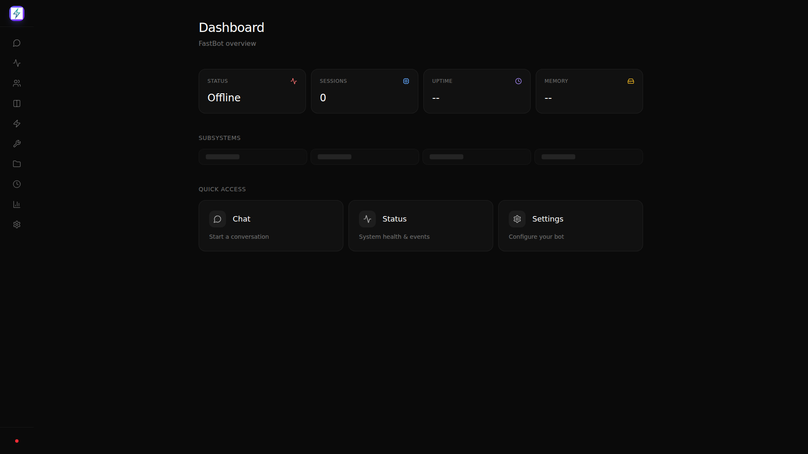
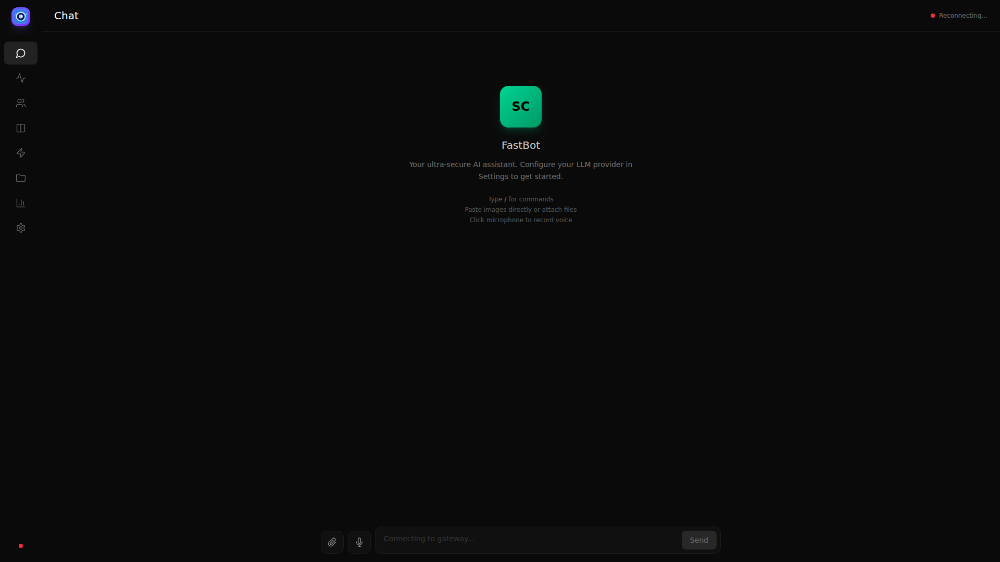
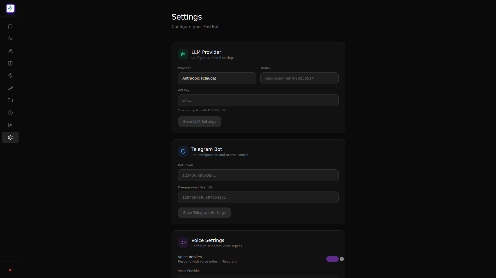
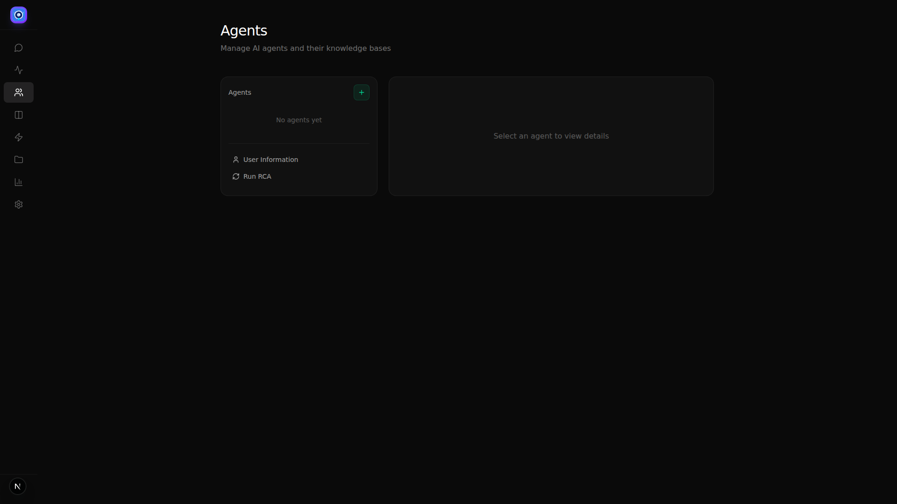
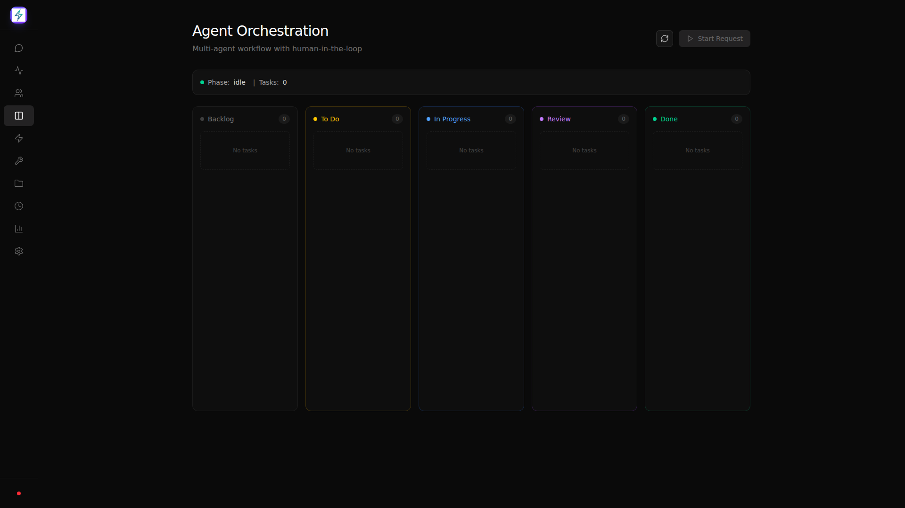
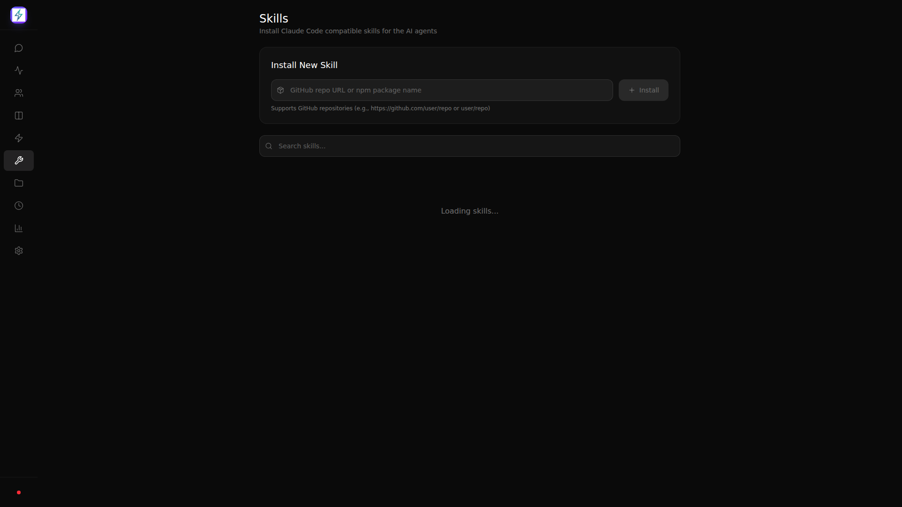
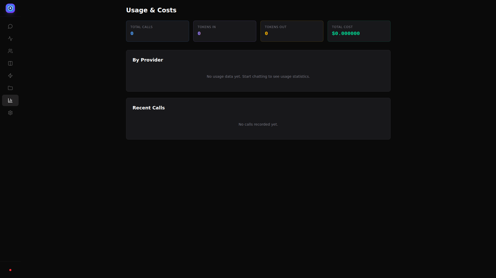
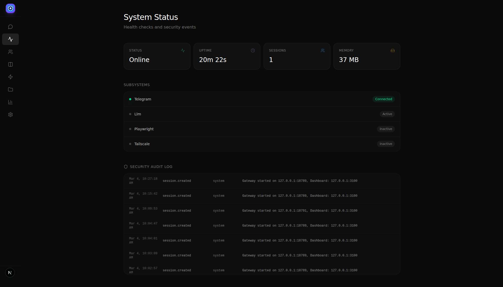
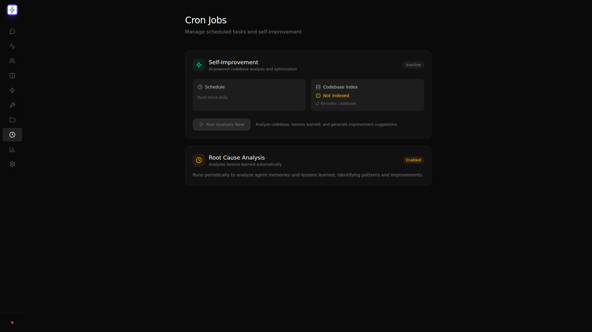

# FastBot

Ultra-secure personal AI gateway. Runs on Android (Termux) or any Node.js server.

## Features

- **Telegram Bot** - Control your AI agent via Telegram (text, voice, photos, and documents)
- **Multi-Provider LLM Router** - OpenAI, Anthropic, Google, Mistral, Cohere, DeepSeek, Groq, Ollama, MiniMax, and more
- **Web Dashboard** - Next.js 14 PWA for mission control
- **Setup Wizard** - First-run guided configuration (Telegram, LLM, JWT authentication)
- **Skills System** - Install Claude Code compatible skills for AI agents
- **Agents Management** - Create and manage AI agents with persistent memories
- **Orchestration** - CrewAI Flows for multi-agent task delegation
- **Kanban Board** - Visual task management with drag-and-drop
- **QMD Search** - Vector search across memories, chat history, and agent files
- **RCA Scheduler** - Automated root cause analysis and lessons learned
- **Self-Improvement** - Automated analysis of agent performance and generation of improvements
- **Sandboxed Browser** - Playwright-based web automation (included)
- **Tailscale Integration** - Secure remote access
- **OAuth Integration** - Google, Microsoft, GitHub authentication
- **Google Sheets Integration** - Read, write, and create spreadsheets
- **Google Drive Integration** - Full file management (list, download, upload, create folders, delete)
- **GitHub Integration** - Create commits, browse repos, manage issues and PRs
- **OCR & Document Understanding** - Extract text from images (Tesseract.js), PDFs, and Office documents
- **File Upload with LLM Processing** - Automatically process uploaded files with AI analysis
- **Audit Logging** - Full activity tracking
- **Security Hardened** - SSRF blocking, path traversal prevention, rate limiting
- **Voice Input** - Whisper transcription for voice notes (Telegram & Dashboard)
- **Voice Output** - TTS synthesis via gTTS, ElevenLabs, OpenAI, Google, Polly, Coqui, or Piper
- **Command Autocomplete** - Type `/` in chat to see available commands
- **File Attachments** - Paste images or attach files in chat
- **Bot Identity** - Customizable personality via identity, role, and memories
- **Auto-Port** - Automatically finds next available port if configured port is in use
- **PM2 Process Manager** - Production-ready process management
- **Cron Jobs** - Automated self-improvement and codebase indexing

## Screenshots

### Dashboard Home


### Chat Interface


### Settings


### Agents


### Kanban Board


### Skills


### Usage


### Status


### Cron Jobs


## Architecture

```
┌─────────────────────────────────────────────────────────────┐
│                        FastBot                               │
├─────────────────────────────────────────────────────────────┤
│  packages/gateway    — Node.js 22 + TypeScript            │
│  ├── Socket.io hub for real-time communication           │
│  ├── Telegram bot command handler                         │
│  ├── LLM router (OpenAI, Anthropic, Google, Ollama)    │
│  ├── Skills manager for Claude Code skills              │
│  ├── CrewAI orchestration for multi-agent workflows     │
│  ├── Google Sheets & Drive API client                   │
│  ├── QMD vector search for memories                      │
│  ├── OCR & document parsing (Tesseract, pdf-parse)      │
│  └── Security: SSRF, path traversal, rate limiting      │
├─────────────────────────────────────────────────────────────┤
│  packages/dashboard   — Next.js 14 PWA                    │
│  ├── Setup wizard for first-run configuration           │
│  ├── Chat interface                                      │
│  ├── Kanban board for task management                    │
│  ├── Workflow automation templates                       │
│  ├── Skills management (install/enable/disable)          │
│  ├── Agents management                                   │
│  ├── Media library                                       │
│  ├── Usage statistics                                    │
│  └── Settings panel                                     │
├─────────────────────────────────────────────────────────────┤
│  packages/playwright — Sandboxed Chromium worker          │
│  ├── Web scraping (scrape, automate, screenshot)          │
│  ├── Isolated from host system                           │
│  └── Communicates via stdin/stdout JSON-RPC              │
├─────────────────────────────────────────────────────────────┤
│  packages/orchestration — Python CrewAI Flows            │
│  ├── SwarmCoordinatorFlow for task delegation           │
│  ├── State persistence with SQLite                      │
│  └── Agent definitions (Brainstormer, Coder, etc.)     │
└─────────────────────────────────────────────────────────────┘
```

## Quick Start

### Prerequisites

- Node.js 22+
- pnpm 10+
- Python 3.11+ (for orchestration)
- Claude Code CLI (installed automatically during setup)
- (Optional) Telegram bot token from @BotFather

### Installation

#### Linux (Ubuntu/Debian)
```bash
# Update package lists
sudo apt-get update

# Install Node.js 22
curl -fsSL https://deb.nodesource.com/setup_22.x | sudo -E bash -
sudo apt-get install -y nodejs

# Install pnpm
npm install -g pnpm

# Install Python 3.11+ (or python3 for any version)
sudo apt-get install python3.11 python3-pip python3-venv || sudo apt-get install python3 python3-pip python3-venv

# Clone and setup
git clone https://github.com/benclawbot/FastBot.git
cd FastBot

# Copy and configure environment variables
cp .env.example .env
# Edit .env with your API keys (Telegram, LLM, etc.)

# Install, build, and launch
pnpm install && pnpm build && pnpm launch
```

#### macOS
```bash
# Update Homebrew
brew update

# Install Homebrew (if not installed)
/bin/bash -c "$(curl -fsSL https://raw.githubusercontent.com/Homebrew/install/HEAD/install.sh)"

# Install Node.js 22 and Python
brew install node@22 python@3.11 || brew install node@22 python@3

# Install pnpm
npm install -g pnpm

# Clone and setup
git clone https://github.com/benclawbot/FastBot.git
cd FastBot

# Copy and configure environment variables
cp .env.example .env
# Edit .env with your API keys (Telegram, LLM, etc.)

# Install, build, and launch
pnpm install && pnpm build && pnpm launch
```

#### Android (Termux)
```bash
# Update Termux
apt update && apt upgrade -y

# Install Node.js and Python
pkg install nodejs python

# Install pnpm
npm install -g pnpm

# Clone and setup
git clone https://github.com/benclawbot/FastBot.git
cd FastBot

# Copy and configure environment variables
cp .env.example .env
# Edit .env with your API keys

# Install, build, and launch
pnpm install --ignore-scripts && pnpm build && pnpm launch
```

#### Windows WSL
```bash
# Install WSL2 (run in PowerShell as admin)
wsl --install

# Inside WSL, follow Linux instructions above
```

### Development vs Production Mode

| Feature | Development | Production |
|---------|-------------|------------|
| **Command** | `pnpm dev` | `npx pm2 start ecosystem.config.cjs` |
| **Hot reload** | Yes | No |
| **Logging** | Console | PM2 logs |
| **Performance** | Slower (live compilation) | Optimized |
| **Use case** | Coding/debugging | 24/7 deployment |

**When to use each:**
- **Development**: When modifying code, testing features, debugging
- **Production**: When running FastBot as a service, accessible remotely

### Running FastBot

After installation, use the launch command to start FastBot:

```bash
pnpm launch
```

This will:
1. Ask you to choose **Development** or **Production** mode
2. Start the selected mode
3. Automatically open your browser to the dashboard at `http://localhost:3100`

**Manual start (Development):**
```bash
pnpm dev
```

**Manual start (Production):**
```bash
npx pm2 start ecosystem.config.cjs
npx pm2 logs
```

### First Run - Setup Wizard

On first run, the dashboard redirects to the Setup Wizard at `/setup`:

1. **Welcome** - Introduction to FastBot
2. **Telegram** - Optionally configure your Telegram bot token
3. **LLM Provider** - Select your preferred AI provider and model
4. **Review** - Confirm and save your configuration
5. **Complete** - JWT authentication is automatically configured

The setup wizard ensures all required settings are configured before using the bot.

### Claude Code CLI Configuration

FastBot uses Claude Code CLI for agent operations and skill management. After setup, you should configure Claude Code to match your LLM preferences:

**Location:** `~/.claude/settings.json` (Linux/macOS) or `%USERPROFILE%\.claude\settings.json` (Windows)

**Key settings to customize:**

```json
{
  "model": "claude-sonnet-4-20250514",
  "maxTokens": 8192,
  "thinking": {
    "enabled": true,
    "budget": 10000
  },
  "dangerouslySkipPermissions": true,
  "allowedTools": ["Read", "Write", "Edit", "Bash", "Glob", "Grep"],
  "hooks": {}
}
```

**Available models:**
- `claude-opus-4-6` - Most capable, for complex tasks
- `claude-sonnet-4-6` - Best for coding (default)
- `claude-haiku-4-5-20251001` - Fastest, for simple tasks
- MiniMax models - For cost optimization

**Settings explained:**
| Setting | Description |
|---------|-------------|
| `model` | The LLM model to use |
| `maxTokens` | Maximum response length |
| `dangerouslySkipPermissions` | Set to `true` to skip prompts (use with caution) |
| `allowedTools` | Tools Claude Code can use |
| `thinking.budget` | Tokens for extended thinking |

**Note:** Claude Code CLI is installed automatically during the FastBot setup process. The `dangerouslySkipPermissions: true` setting allows agents to execute tools without prompts.

### Configuration

Edit `config.json` in `packages/gateway/`:

```json
{
  "server": {
    "port": 44512,
    "dashboardPort": 3100,
    "host": "0.0.0.0"
  },
  "telegram": {
    "botToken": "your_bot_token",
    "approvedUsers": [your_telegram_id],
    "voiceReplies": true,
    "voiceProvider": "gtts",
    "voiceId": "en",
    "voiceSpeed": 1.0
  },
  "llm": {
    "primary": {
      "provider": "minimax",
      "model": "M2.5",
      "apiKey": "your_api_key"
    },
    "fallbacks": []
  },
  "voice": {
    "provider": "gtts",
    "elevenLabsApiKey": "your_elevenlabs_key"
  },
  "security": {
    "pin": "your_pin",
    "dashboardRateLimit": 60,
    "jwtSecret": "auto-generated"
  },
  "agents": {
    "directory": "./data/agents",
    "enableRcaCron": true,
    "rcaCronSchedule": "0 2 * * *"
  },
  "playwright": {
    "enabled": true,
    "browser": "chromium"
  },
  "tailscale": {
    "enabled": false
  }
}
```

### Running

```bash
# Development mode
pnpm dev

# Production mode with PM2 (recommended)
npx pm2 start ecosystem.config.cjs

# View logs
npx pm2 logs

# Restart services
npx pm2 restart all
```

**Note:** Playwright/Chromium is automatically installed with `pnpm install`. No separate installation needed.

**Orchestration** starts automatically with PM2. For manual start:
```bash
cd packages/orchestration
pip install crewai pydantic sqlalchemy
python -m src.scb_orchestration.server
```

## Packages

### @fastbot/gateway

The core gateway service.

**Ports:**
- WebSocket: `configurable` - Uses configured port, auto-finds next available if in use
- Dashboard port: `3100`

**Socket Events:**
- `chat:message` - Send/receive chat messages
- `chat:stream:start`, `chat:stream:chunk`, `chat:stream:end` - Streaming responses
- `voice:transcribe` - Transcribe audio (base64 encoded)
- `voice:speak` - Generate TTS audio
- `voice:settings:update` - Update voice settings
- `voice:test` - Test voice with sample text
- `setup:check` - Check if initial setup is needed
- `setup:complete` - Save initial configuration
- `media:list`, `media:get`, `media:delete` - Media management
- `orchestration:*` - Orchestration control
- `qmd:search` - Vector search queries
- `tailscale:status` - Tailscale status
- `file:upload` - Upload files/images

### @fastbot/dashboard

Next.js PWA for user interface.

**Ports:**
- Dashboard: `3100`

**Pages:**
- `/` - Dashboard home (redirects to /setup if not configured)
- `/setup` - First-run setup wizard
- `/chat` - Chat interface
- `/kanban` - Task board (with orchestration)
- `/workflows` - Workflow automation
- `/skills` - Skills management (install Claude Code skills)
- `/agents` - Agent management
- `/status` - System status
- `/usage` - Usage statistics
- `/settings` - Configuration
- `/media` - Media files library

### @fastbot/playwright

Sandboxed browser automation worker.

**Commands:**
- `scrape` - Extract page title and text
- `screenshot` - Take a screenshot
- `automate` - Run a sequence of actions

### @fastbot/orchestration

Python CrewAI Flows for multi-agent orchestration.

**Features:**
- SwarmCoordinatorFlow with human-in-the-loop
- SQLite state persistence
- Agent definitions: Brainstormer, Infra-Architect, StoryWriter, Coder, Tester

## Agents System

Each agent has persistent markdown files:
- `identity.md` - Who the agent is
- `role.md` - Goals, tools, resources
- `memories.md` - Notable events and accomplishments
- `lessons_learned.md` - Root cause analysis and solutions

### Creating an Agent

1. Go to `/agents` in the dashboard
2. Click the + button
3. Enter name and role
4. The agent will initialize with default files

### RCA Scheduler

Automatic Root Cause Analysis runs periodically (configurable) to:
- Analyze warnings in agent memories
- Add lessons learned automatically
- Improve agent performance over time

## Orchestration

Trigger orchestration from:
1. **Dashboard** - Use the Kanban board at `/kanban`
2. **Chat** - Use keywords like "build a project" or commands like `/delegate`

The chatbot will detect delegation requests and start the orchestration workflow.

## Bot Identity

Customize your chatbot's personality by editing files in `data/bot/`:

- `identity.md` - Defines who the chatbot is (personality, tone, values)
- `role.md` - Defines capabilities and available tools
- `memories.md` - Learned information and user preferences

The bot's identity is loaded as a system prompt, so the chatbot will:
- Adopt the defined personality and communication style
- Use the tools and capabilities listed in role.md
- Reference memories when interacting

## Voice Capabilities

**Voice Input (Whisper):**
- Send voice notes via Telegram - they will be transcribed and processed
- Use the microphone button in the dashboard chat
- Supports multiple audio formats (ogg, webm, mp3)

**Voice Output (TTS):**
Configure in Settings (Dashboard) or config.json:

- **gTTS** (free, default) - Google Translate TTS
- **ElevenLabs** - Premium neural TTS
- **OpenAI** - TTS-1 voices
- **Coqui** - Open source local TTS
- **Piper** - Fast neural TTS (local)

Voice settings in dashboard:
- Toggle voice replies on/off
- Select voice provider
- Choose language/voice
- Adjust voice speed (0.5x - 2.0x)
- Test button to preview voice

## OCR & Document Understanding

FastBot can extract text from images and documents using OCR and document parsing:

**Supported Formats:**
- **Images:** jpeg, png, gif, webp, bmp, tiff (via Tesseract.js)
- **PDF:** Text extraction via pdf-parse
- **Office Documents:** DOCX, XLSX, PPTX (via mammoth and xlsx)

**How it works:**
1. Upload an image or document via Telegram or the dashboard
2. FastBot automatically extracts the text content
3. The extracted text is processed by the LLM and summarized
4. Results are displayed in the chat and stored in the media library

**Use cases:**
- Extract text from scanned documents
- Read text from screenshots
- Parse PDF reports
- Analyze Excel spreadsheets
- Extract content from Word documents

## Cron Jobs

FastBot includes automated cron jobs for self-improvement and codebase maintenance:

### Self-Improvement

The system periodically analyzes agent memories and chat history to:
- Identify patterns in agent behavior
- Generate improvement suggestions
- Create code references for better performance

### Codebase Indexing

Automatic or on-demand indexing of TypeScript source code:
- Indexes functions, classes, interfaces, and types
- Enables QMD semantic search across your codebase
- Shows index statistics (files, chunks, last indexed)

Access the Cron Jobs page at `/cron` in the dashboard to:
- View current status
- Trigger manual indexing
- Review self-improvement reports
- Configure scheduling

## QMD Search

Query Memory Data provides semantic search across:
- Agent files (identity, role, memories, lessons)
- Chat history
- Stored memories
- **Codebase** - Index and search your TypeScript source code

### Codebase Indexing

The QMD system can now index your FastBot codebase for semantic search:

1. Go to `/cron` in the dashboard
2. Click "Index Codebase" to scan TypeScript files
3. Once indexed, the chatbot can search across your code

The indexer extracts:
- Functions, classes, interfaces, and types
- File paths and line numbers
- Context around each code element

This enables the AI to reference your codebase directly during conversations.

## Security

### Implemented Protections

1. **SSRF Blocking** - Prevents access to internal networks
2. **Path Traversal Prevention** - Blocks directory traversal attacks
3. **Binary Allowlist** - Only allowed executables can run
4. **Rate Limiting** - Prevents abuse
5. **Audit Logging** - Append-only log of all activities
6. **Encrypted Secrets** - AES-256-GCM encryption with PBKDF2 key derivation
7. **PIN Protection** - All secrets encrypted with user PIN

### Audit Events

| Event | Description |
|-------|-------------|
| `auth.login` | Successful login |
| `auth.login_failed` | Failed login attempt |
| `tool.executed` | Tool was executed |
| `tool.blocked` | Tool was blocked |
| `security.ssrf_blocked` | SSRF attack blocked |
| `security.path_traversal` | Path traversal blocked |
| `security.rate_limited` | Rate limit exceeded |
| `agent.spawned` | Agent spawned |
| `agent.completed` | Agent completed |
| `session.created` | New session created |

## Authentication

The dashboard uses JWT-based authentication:

1. **First access**: You'll see a PIN entry modal (any PIN with 4+ characters works)
2. **Auto-login**: After first login, a JWT token is stored in localStorage
3. **Persistent**: Token is automatically used for subsequent visits
4. **Fallback**: If no JWT is found, you can enter any PIN to authenticate

**Security**: All sensitive data (API keys) is encrypted with AES-256-GCM in the keystore.

## Commands (Telegram)

```
/start - Start the bot
/help - Show help message
/status - Check system status
/voice - Enable voice replies
/text - Disable voice replies
/models - List available LLM models
```

## Development

```bash
# Type check all packages
pnpm build

# Run tests
pnpm --filter @fastbot/gateway test

# Lint
pnpm lint
```

## Troubleshooting

### Build Errors

If you get TypeScript errors about `document` in playwright:
```bash
# The tsconfig needs "DOM" lib
# Already fixed in packages/playwright/tsconfig.json
```

### Port Conflicts

The gateway automatically finds the next available port if the configured port is in use. Check the `.gateway-port` file for the current port.

### Database Issues

Delete the database file and restart:
```bash
rm data/scb.db
npx pm2 restart all
```

### Telegram Bot Not Responding

1. Check if Telegram is connected: `npx pm2 logs gateway | grep telegram`
2. Ensure your user ID is in `approvedUsers` in config.json
3. Restart the gateway: `npx pm2 restart gateway`

### Voice Not Working

1. Ensure faster-whisper is installed: `pip install faster-whisper`
2. For TTS, configure provider in Settings or config.json
3. Use the Test Voice button in Settings to verify

### Tailscale

For Tailscale to work without sudo:
```bash
sudo tailscale up  # First time - auth via browser
sudo tailscale set --operator=$USER  # Allow non-sudo access
```

## License

MIT
