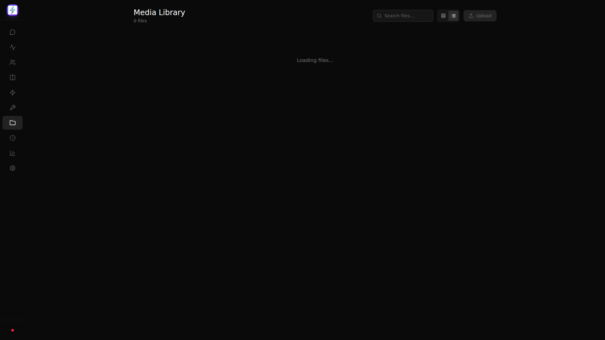

# FastBot

Ultra-secure personal AI gateway inspired by OpenClaw. Runs on Android (Termux) or any Node.js server.

## Features

- **Telegram Bot** - Control your AI agent via Telegram (text and voice)
- **Multi-Provider LLM Router** - OpenAI, Anthropic, Google, Ollama, MiniMax, Groq, DeepSeek, and more
- **Web Dashboard** - Next.js PWA for mission control
- **Setup Wizard** - First-run guided configuration (PIN, Telegram, LLM)
- **Agents Management** - Create and manage AI agents with persistent memories
- **Orchestration** - CrewAI Flows for multi-agent task delegation
- **QMD Search** - Vector search across memories, chat history, and agent files
- **RCA Scheduler** - Automated root cause analysis and lessons learned
- **Sandboxed Browser** - Playwright-based web automation (included)
- **Tailscale Integration** - Secure remote access
- **OAuth Integration** - Google, Microsoft, GitHub authentication
- **Audit Logging** - Full activity tracking
- **Security Hardened** - SSRF blocking, path traversal prevention, rate limiting
- **Voice Input** - Whisper transcription for voice notes (Telegram & Dashboard)
- **Voice Output** - TTS synthesis via ElevenLabs, OpenAI, or free gTTS
- **Media Library** - Upload and manage images, videos, audio, and documents
- **Command Autocomplete** - Type `/` in chat to see available commands
- **File Attachments** - Paste images or attach files in chat
- **Bot Identity** - Customizable personality via identity, role, and memories
- **Port Auto-detection** - Automatically finds available port if configured port is in use
- **PM2 Process Manager** - Production-ready process management

## Screenshots

### Dashboard Home


### Chat Interface


### Settings


### Media Library


### Agents


### Usage


### Status


## Architecture

```
┌─────────────────────────────────────────────────────────────┐
│                        FastBot                               │
├─────────────────────────────────────────────────────────────┤
│  packages/gateway    — Node.js 22 + TypeScript            │
│  ├── Socket.io hub for real-time communication           │
│  ├── Telegram bot command handler                         │
│  ├── LLM router (OpenAI, Anthropic, Google, Ollama)    │
│  ├── Agent orchestrator                                  │
│  ├── QMD vector search for memories                      │
│  └── Security: SSRF, path traversal, rate limiting      │
├─────────────────────────────────────────────────────────────┤
│  packages/dashboard   — Next.js 14 PWA                    │
│  ├── Setup wizard for first-run configuration           │
│  ├── Kanban board for task management                    │
│  ├── Chat interface                                      │
│  ├── Agents management                                   │
│  ├── Media library                                       │
│  ├── Usage statistics                                    │
│  └── Settings panel                                     │
├─────────────────────────────────────────────────────────────┤
│  packages/playwright — Sandboxed Chromium worker          │
│  ├── Web scraping (scrape, automate, screenshot)          │
│  ├── Isolated from host system                           │
│  └── Communicates via stdin/stdout JSON-RPC              │
├─────────────────────────────────────────────────────────────┤
│  packages/orchestration — Python CrewAI Flows            │
│  ├── SwarmCoordinatorFlow for task delegation           │
│  ├── State persistence with SQLite                      │
│  └── Agent definitions (Brainstormer, Coder, etc.)     │
└─────────────────────────────────────────────────────────────┘
```

## Quick Start

### Prerequisites

- Node.js 22+
- pnpm 10+
- Python 3.11+ (for orchestration)
- (Optional) Telegram bot token from @BotFather

### Installation

```bash
# Clone the repository
git clone https://github.com/benclawbot/FastBot.git
cd FastBot

# Install dependencies
pnpm install

# Build all packages
pnpm build
```

### First Run - Setup Wizard

On first run, the dashboard redirects to the Setup Wizard at `/setup`:

1. **Welcome** - Introduction to FastBot
2. **Security PIN** - Create a PIN to encrypt your API keys (minimum 4 characters)
3. **Telegram** - Optionally configure your Telegram bot token
4. **LLM Provider** - Select your preferred AI provider and model
5. **Review** - Confirm and save your configuration

The setup wizard ensures all required settings are configured before using the bot.

### Configuration

Alternatively, edit `config.json` in `packages/gateway/`:

```json
{
  "server": {
    "port": 18789,
    "dashboardPort": 3100,
    "host": "127.0.0.1"
  },
  "telegram": {
    "botToken": "your_bot_token",
    "approvedUsers": [your_telegram_id],
    "voiceReplies": true,
    "voiceProvider": "gtts",
    "voiceId": "en",
    "voiceSpeed": 1.0
  },
  "llm": {
    "primary": {
      "provider": "minimax",
      "model": "M2.5",
      "apiKey": "your_api_key"
    },
    "fallbacks": []
  },
  "voice": {
    "provider": "gtts",
    "elevenLabsApiKey": "your_elevenlabs_key"
  },
  "security": {
    "pin": "your_pin",
    "dashboardRateLimit": 60,
    "jwtSecret": "auto-generated"
  },
  "agents": {
    "directory": "./data/agents",
    "enableRcaCron": true,
    "rcaCronSchedule": "0 2 * * *"
  },
  "playwright": {
    "enabled": true,
    "browser": "chromium"
  },
  "tailscale": {
    "enabled": false
  }
}
```

**Port Auto-detection:** If the configured port is already in use, the gateway will automatically try the next 10 ports.

### Running

```bash
# Development mode
pnpm dev

# Production mode with PM2 (recommended)
npx pm2 start ecosystem.config.js

# View logs
npx pm2 logs

# Restart services
npx pm2 restart all
```

**Note:** Playwright/Chromium is automatically installed with `pnpm install`. No separate installation needed.

**Orchestration** starts automatically with PM2. For manual start:
```bash
cd packages/orchestration
pip install crewai pydantic sqlalchemy
python -m src.scb_orchestration.server
```

## Packages

### @fastbot/gateway

The core gateway service.

**Ports:**
- WebSocket: `18789`
- HTTP: `18788` (optional)

**Socket Events:**
- `chat:message` - Send/receive chat messages
- `chat:stream:start`, `chat:stream:chunk`, `chat:stream:end` - Streaming responses
- `voice:transcribe` - Transcribe audio (base64 encoded)
- `voice:speak` - Generate TTS audio
- `voice:settings:update` - Update voice settings
- `voice:test` - Test voice with sample text
- `setup:check` - Check if initial setup is needed
- `setup:complete` - Save initial configuration
- `media:list`, `media:get`, `media:delete` - Media management
- `orchestration:*` - Orchestration control
- `qmd:search` - Vector search queries
- `tailscale:status` - Tailscale status
- `file:upload` - Upload files/images

### @fastbot/dashboard

Next.js PWA for user interface.

**Ports:**
- Dashboard: `3100`

**Pages:**
- `/` - Dashboard home (redirects to /setup if not configured)
- `/setup` - First-run setup wizard
- `/chat` - Chat interface
- `/kanban` - Task board (with orchestration)
- `/agents` - Agent management
- `/status` - System status
- `/usage` - Usage statistics
- `/settings` - Configuration
- `/media` - Media files library
- `/workflows` - Workflow automation

### @fastbot/playwright

Sandboxed browser automation worker.

**Commands:**
- `scrape` - Extract page title and text
- `screenshot` - Take a screenshot
- `automate` - Run a sequence of actions

### @fastbot/orchestration

Python CrewAI Flows for multi-agent orchestration.

**Features:**
- SwarmCoordinatorFlow with human-in-the-loop
- SQLite state persistence
- Agent definitions: Brainstormer, Infra-Architect, StoryWriter, Coder, Tester

## Agents System

Each agent has persistent markdown files:
- `identity.md` - Who the agent is
- `role.md` - Goals, tools, resources
- `memories.md` - Notable events and accomplishments
- `lessons_learned.md` - Root cause analysis and solutions

### Creating an Agent

1. Go to `/agents` in the dashboard
2. Click the + button
3. Enter name and role
4. The agent will initialize with default files

### RCA Scheduler

Automatic Root Cause Analysis runs periodically (configurable) to:
- Analyze warnings in agent memories
- Add lessons learned automatically
- Improve agent performance over time

## Orchestration

Trigger orchestration from:
1. **Dashboard** - Use the Kanban board at `/kanban`
2. **Chat** - Use keywords like "build a project" or commands like `/delegate`

The chatbot will detect delegation requests and start the orchestration workflow.

## Bot Identity

Customize your chatbot's personality by editing files in `data/bot/`:

- `identity.md` - Defines who the chatbot is (personality, tone, values)
- `role.md` - Defines capabilities and available tools
- `memories.md` - Learned information and user preferences

The bot's identity is loaded as a system prompt, so the chatbot will:
- Adopt the defined personality and communication style
- Use the tools and capabilities listed in role.md
- Reference memories when interacting

## Voice Capabilities

**Voice Input (Whisper):**
- Send voice notes via Telegram - they will be transcribed and processed
- Use the microphone button in the dashboard chat
- Supports multiple audio formats (ogg, webm, mp3)

**Voice Output (TTS):**
Configure in Settings (Dashboard) or config.json:

- **gTTS** (free, default) - Google Translate TTS
- **ElevenLabs** - Premium neural TTS
- **OpenAI** - TTS-1 voices
- **Coqui** - Open source local TTS
- **Piper** - Fast neural TTS (local)

Voice settings in dashboard:
- Toggle voice replies on/off
- Select voice provider
- Choose language/voice
- Adjust voice speed (0.5x - 2.0x)
- Test button to preview voice

## Media Library

Upload and manage files in `/media`:
- **Images:** jpeg, png, gif, webp, svg, bmp, tiff
- **Videos:** mp4, webm, ogg, quicktime, avi
- **Audio:** mp3, wav, ogg, webm
- **Documents:** pdf, doc, docx, xls, xlsx, ppt, pptx
- **Text:** txt, md, csv, json, html, css, js
- **Archives:** zip, tar, gzip, rar, 7z

Features:
- Grid and list view modes
- Search files
- Preview images and documents
- Delete files

## QMD Search

Query Memory Data provides semantic search across:
- Agent files (identity, role, memories, lessons)
- Chat history
- Stored memories

Use the `qmd:search` socket event to search.

## Security

### Implemented Protections

1. **SSRF Blocking** - Prevents access to internal networks
2. **Path Traversal Prevention** - Blocks directory traversal attacks
3. **Binary Allowlist** - Only allowed executables can run
4. **Rate Limiting** - Prevents abuse
5. **Audit Logging** - Append-only log of all activities
6. **Encrypted Secrets** - AES-256-GCM encryption with PBKDF2 key derivation
7. **PIN Protection** - All secrets encrypted with user PIN

### Audit Events

| Event | Description |
|-------|-------------|
| `auth.login` | Successful login |
| `auth.login_failed` | Failed login attempt |
| `tool.executed` | Tool was executed |
| `tool.blocked` | Tool was blocked |
| `security.ssrf_blocked` | SSRF attack blocked |
| `security.path_traversal` | Path traversal blocked |
| `security.rate_limited` | Rate limit exceeded |
| `agent.spawned` | Agent spawned |
| `agent.completed` | Agent completed |
| `session.created` | New session created |

## Commands (Telegram)

```
/start - Start the bot
/help - Show help message
/status - Check system status
/voice - Enable voice replies
/text - Disable voice replies
/models - List available LLM models
```

## Development

```bash
# Type check all packages
pnpm build

# Run tests
pnpm --filter @fastbot/gateway test

# Lint
pnpm lint
```

## Troubleshooting

### Build Errors

If you get TypeScript errors about `document` in playwright:
```bash
# The tsconfig needs "DOM" lib
# Already fixed in packages/playwright/tsconfig.json
```

### Port Conflicts

If ports are already in use, the gateway will automatically find the next available port. Check the logs to see which port is being used.

### Database Issues

Delete the database file and restart:
```bash
rm data/scb.db
npx pm2 restart all
```

### Telegram Bot Not Responding

1. Check if Telegram is connected: `npx pm2 logs gateway | grep telegram`
2. Ensure your user ID is in `approvedUsers` in config.json
3. Restart the gateway: `npx pm2 restart gateway`

### Voice Not Working

1. Ensure faster-whisper is installed: `pip install faster-whisper`
2. For TTS, configure provider in Settings or config.json
3. Use the Test Voice button in Settings to verify

### Tailscale

For Tailscale to work without sudo:
```bash
sudo tailscale up  # First time - auth via browser
sudo tailscale set --operator=$USER  # Allow non-sudo access
```

## License

MIT
